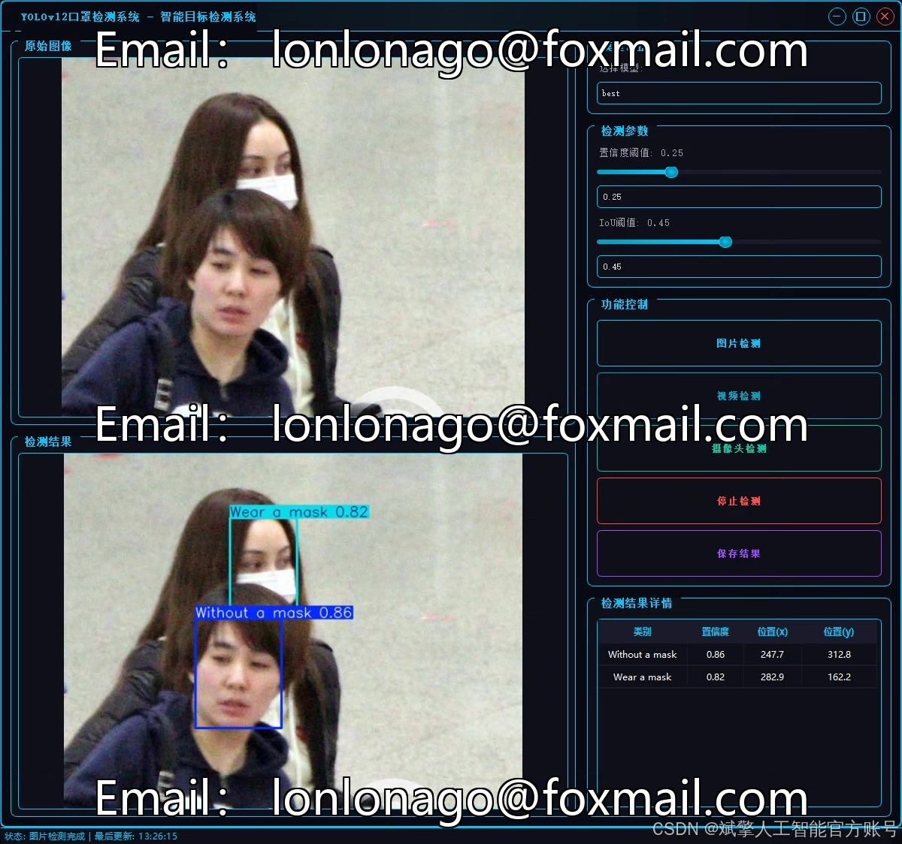
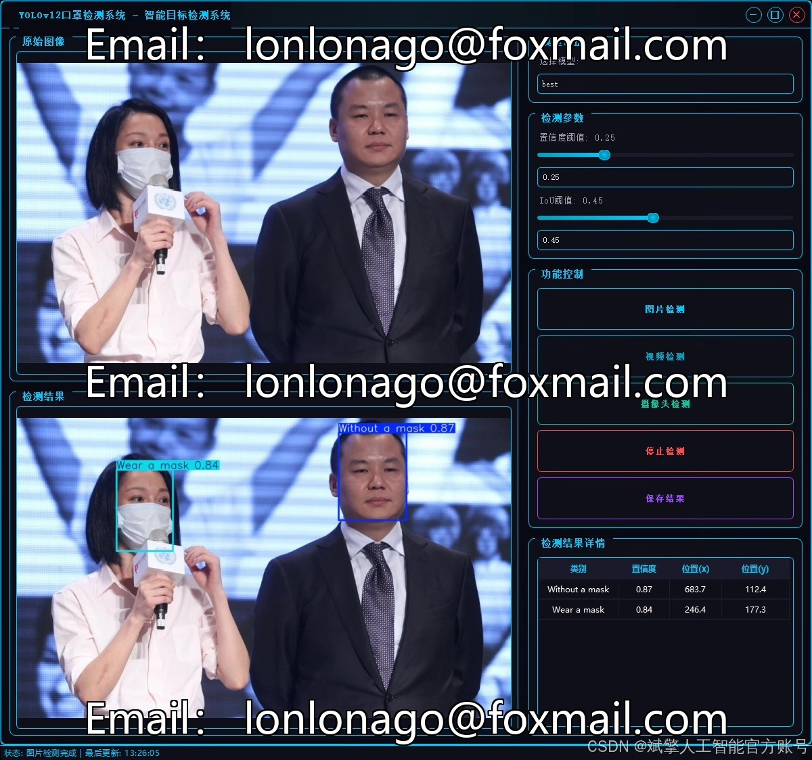
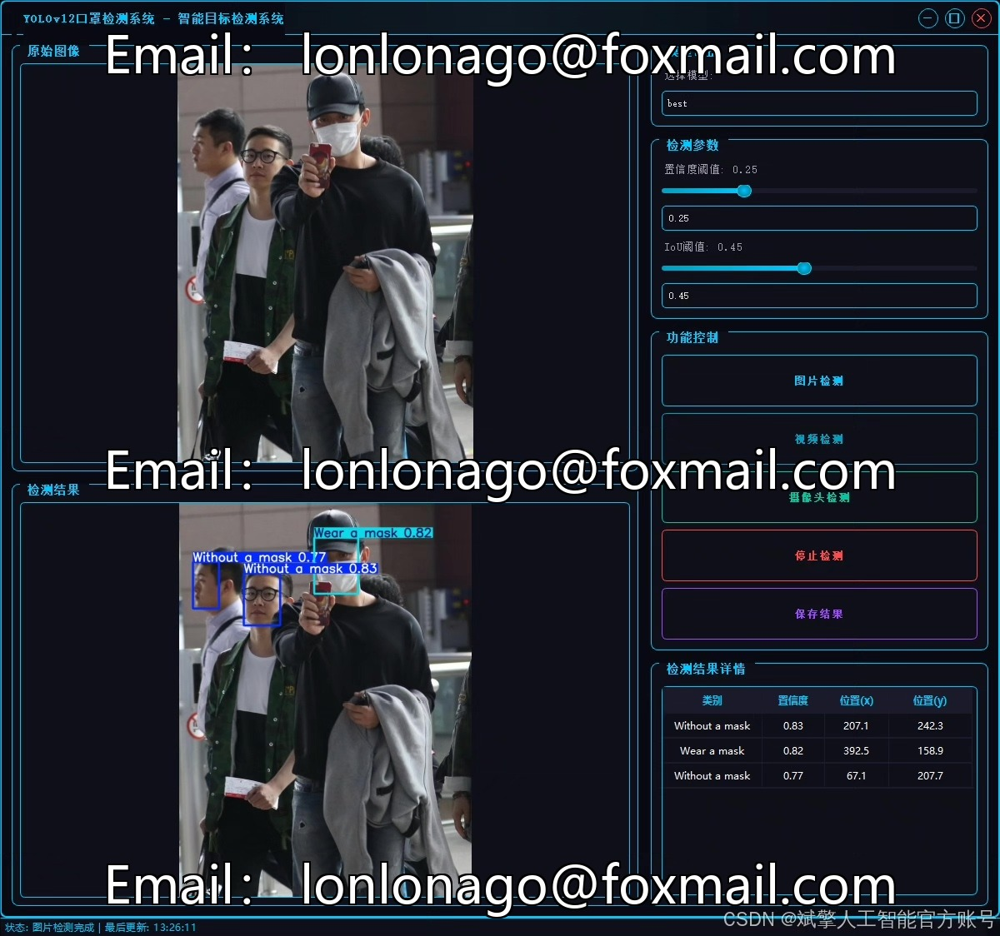
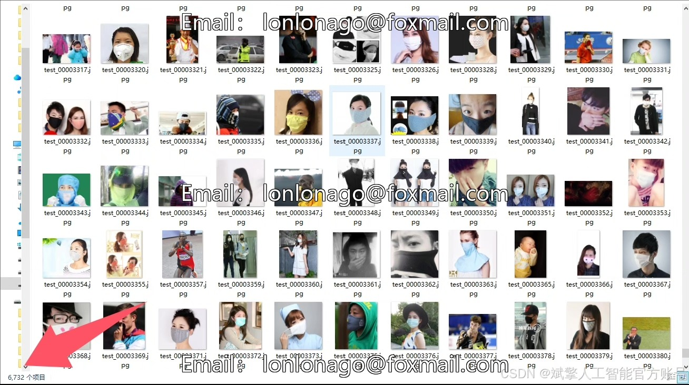
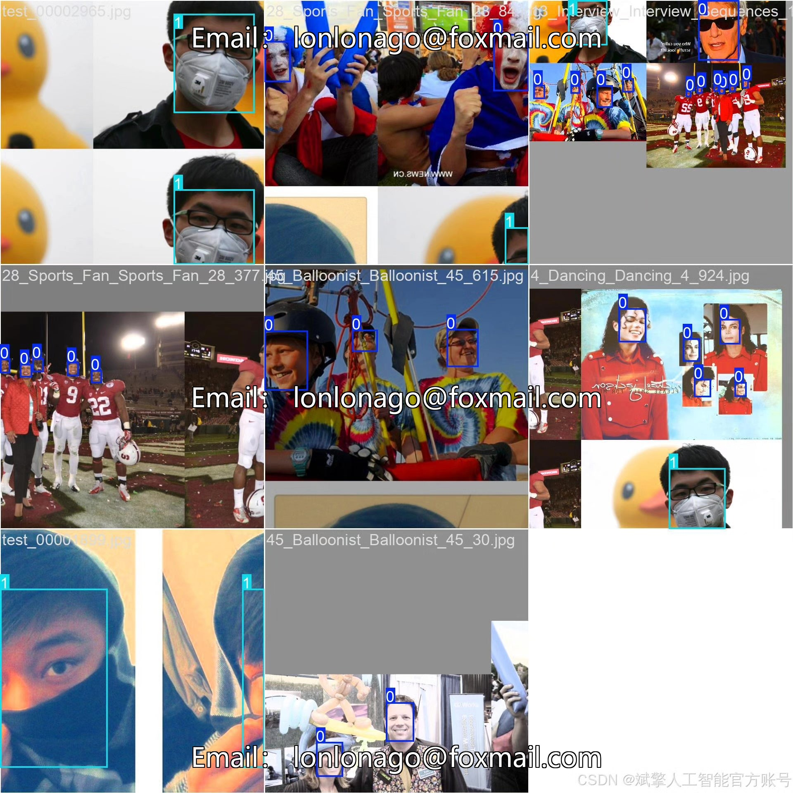
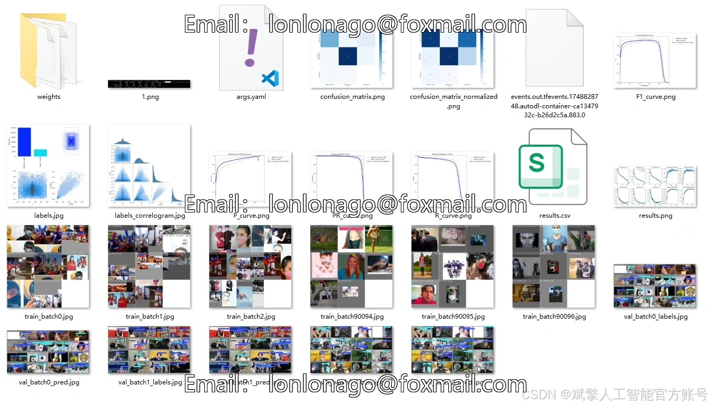
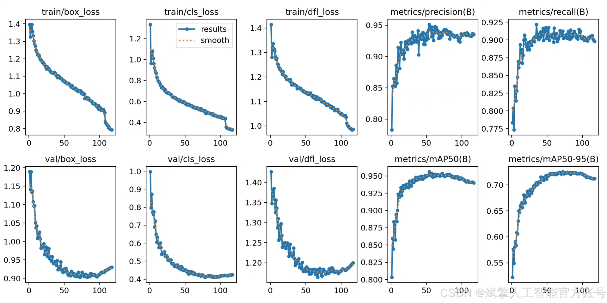
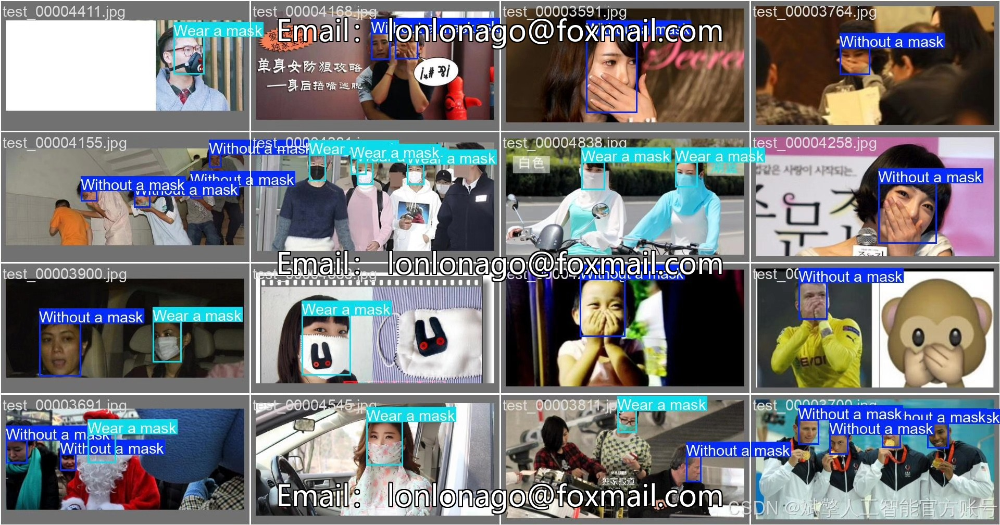

# YOLOv12 mask recognition system

## Body

This paper proposes a mask recognition detection system based on the YOLOv12 deep learning algorithm, aiming to achieve automated monitoring of people's mask wearing conditions in public places. The system adopts an improved YOLOv12 object detection architecture and optimizes for the mask recognition task. A custom dataset containing 7,959 labeled images was constructed, with 6,732 training images, 1,227 validation images, and two categories: "wearing a mask" and "not wearing a mask." The system achieves high-precision real-time detection capabilities, with an average precision (mAP) of 96.2%. The detection speed reached 45FPS on the NVIDIA GTX 1080Ti graphics card. To facilitate practical applications, a complete user interface (UI) was developed, including login and registration functions as well as management backend. Experimental results show that the system exhibits good robustness under different lighting conditions, crowd density, and occlusion situations, and can be widely applied in fields such as epidemic prevention and control and intelligent security. This study provides a complete solution for developing real-time target detection systems based on deep learning, including data processing, model training, and system integration.

Dataset:
nc: 2 classes,
Name: ['Without a mask', 'Wear a mask'],
Number of datasets: Training set 6,732, Validation set 1,227.

✅ User login and registration: Supports password verification and security validation.
✅ Three detection modes: Based on the YOLOv12 model, supports image, video, and real-time camera detection, accurately identifying targets.
✅ Dual-screen comparison: Displays original images and detection results on the same screen.
✅ Data visualization: Real-time table displaying the category, confidence, and coordinates of detected targets.
✅ Intelligent parameter adjustment: Offers a confidence slide bar for dynamic optimization of detection accuracy to meet different scene needs.
✅ Sci-fi style interactive interface: Dark theme combined with dynamic light effects, reducing visual fatigue and improving operational experience.

## Images

## Payment

Here is a pay link on Stripe ( https://buy.stripe.com/3cs8yP7sY87d0vu9AB ). Please contact me lonlonago@foxmail.com after funding $89, and I will send you a complete data files , thank you!

